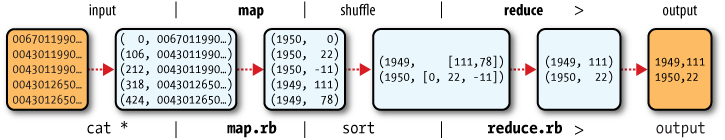
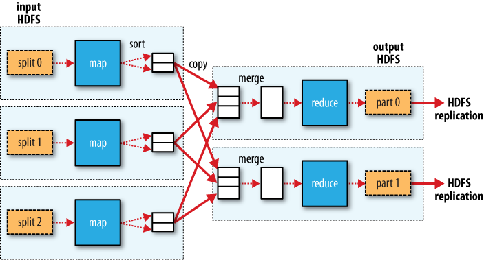

# Mapreduce

## Analyzing the Data with Hadoop MapReduce

Each phase has key-value pairs as input and output that may be chosen by the programmer. The input of the map phase is a text input that gives each line in a dataset as text value. The key is the offset from the beginning of the file so:

	key 				value
	[line-number]		[content of the line]
	1					First line of the dataset
	2					Second line...
	50					Line 50th of the dataset

The output of the Map is processed by the MapReduce framework before being sent to the Reduce:

#### Implementation: Map

The Map declares an abstract map() method and extends Mapper with four formal type parameters that, in order, are input and output key-value in that order. Also provides a Context object to write the output to. Hadoop uses its own implementations of Java types for IO, for example:

	Long 		-> LongWritable
	String 		-> Text
	Integer		-> IntWritable
	Null		-> NullWritable
	Double		-> DoubleWritable
	Object 		-> ObjectWritable
	Short		-> ShortWritable
	Map 		-> MapWritable
	Tuple		-> TupleWritable

#### Implementation: Reduce

The Reducer declares the reduce() method and takes also 4 parameters, the first 2 must match the last 2 of the Mapper. It also gives a Context object to write.

#### Implementation: Job

In the job you match the Mapper and the Reducer. Generally this methods are critical:

* **Job.setJarByClass()** to specify the name of the Job class
* **Job.setJobName()** to give a name to the job
* **File[ Input/Output ]Format.add[Input/Output]Path()** To specify the input dataset and output result
* **Job.set[ Mapper/Reducer/Combiner ]Class()** to specify the classes of the mapper, reducer and combiner class
* **Job.setOutput[ Key/Value ]Class()** to specify the Hadoop classes of the output result
* **Job.waitForCompletion(true) ? 0 : 1** Submits the job and waits until it finish. The true indicates to output information to the console of the job and the 0/1 indicates the success or fail of the job.
* **Job.setCombiner

#### Running the Job

Run the jar with hadoop command as it has the source libraries (java does not). 

## Result

The output gives lots of info:
	INFO mapreduce.Job: Running job: job_local_0001								-> id of the job
	INFO mapred.LocalJobRunner: Starting task: attempt_local_0001_m_000000_0	-> map task id
	INFO mapred.Task: Task 'attempt_local_0001_m_000000_0' done					-> map task finished
	INFO mapred.Task: Task 'attempt_local_0001_r_000000_0' done.				-> reduce task finished
	INFO output.FileOutputCommitter: Saved output of task ... to file:/...		-> output result and path

## Scaling out

### Data Flow

The jobtracker coordinates all the jobs run on the system by scheduling tasks to run on tasktrackers. Tasktrackers run tasks and send progress reports to the jobtracker, which keeps a record of the overall progress of each job.

Hadoop divides inputs in **input-splits** or **splits** with one map for each split for each *record* in the split. Many small splits can be well processed in parallel but they can't be too small. 64 mb is the recommended split size.

*Data locality optimization* is when Hadoop runs jobs with data in its HDFS because don't use too much bandwith. Sometimes this is not possible as all nodes with replicas of the split are already running a Map. Then it will look for a free map slot in the same rack or outside the rack if there are not free nodes in the same rack.

With more than one-block, its difficult that the same node has more than one of the splits so some of the split must be transferred throught the nodes.

**Map writes the output to the local disk, not to HDFS** because it is an intermediate output before taking it to the reducer. To pass it to HDFS (with the replication) would be overkill.

**Reduce don't have data locality optimization**. The input to a single reduce is usually the output of all mappers that has benn network transferred. The first replica of the reduce is written in the local HDFS and other will be written in off-rack nodes.

They can be one or multiple reducers tasks. If there are more than one the mapper partition the output but the records for a given key will be all in the same partition always.

## Combiner
A combiner runs the reduce task at end of each mapper process before submitting to the reducer. This helps reduce data transferred between map and reduce. It doesn't replace the reduce but it helps to reduce in advance if it's possible. For example the average of 10 numbers if the same than the average of the first 5 (combiner) plus the last 5 (combiner) to produce to outputs and find the average of the last two (reducer)

## Hadoop Streaming

Uses Unix standard streams to write MR programs in any language other than Java. A key difference is that the Java API process a map for each record where in streaming you could choose to process more than one line before sending to the output. Another advantage is that is easy to debug as Streaming only uses std IO so it does not need Hadoop to get executed in development.

1. Map input is passed over standard input to process line by line
2. Map output is written as single tab-delimited line
3. Input takes that line passed over standard input
4. Input reads, process and writes to standard output

To run a streaming program you should use the hadoop-*streaming.jar. This is an example:
	% hadoop jar $HADOOP_INSTALL/contrib/streaming/hadoop-*-streaming.jar \
	-input input/ncdc/sample.txt \
	-output output \
	-mapper ch02/src/main/ruby/max_temperature_map.rb \
	-combiner ch02/src/main/ruby/max_temperature_reduce.rb \
	-reducer ch02/src/main/ruby/max_temperature_reduce.rb

## Hadoop Pipes

C++ interface to Hadoop MapReduce using sockets. JNI is not used. Keys and values **ARE** C++ native byte buffers STL strings. They don't work in local mode, only pseudo or fully distributed. To run a pipe:

	% hadoop pipes \
	-D hadoop.pipes.java.recordreader=true \
	-D hadoop.pipes.java.recordwriter=true \
	-input sample.txt \
	-output output \
	-program bin/max_temperature

Where max_temperature is the compiled C++ file. The record reader and writer specifies to use the Java ones if no other are specified in the C++ source code.