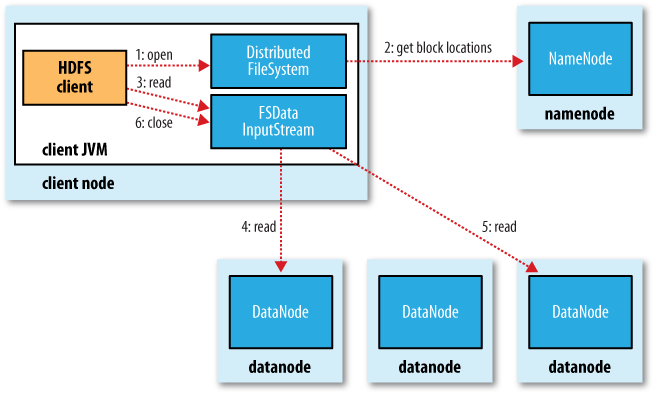

# Hadoop Distributed File System HDFS

## Good for

* **Very large files** Over hundreds of MB
* **Streaming data access** Write-once, read-many. Time to read whole dataset is more important than time to read the first record
* **Commodity hardware** Doesn't require expensive hardware

## Not good for

* **Low-latency data access**
* **Lots of small files**
* **Multiple writers, arbitrary file modifications** No support for multiple writers on the same file

## HDFS Concepts

### Blocks

Minimum amount of data a disk can read. 64 MB for HDFS. If a file is smaller than a single block, it does not occupy a full block. They are larger to minimize the cost of seeks because time to transfer data from disk is larger than seeking for a file.

Blocks allows to store huge files (bigger than a hard disk) splitting it's block over the cluster, so it also does not need to be stored in the same disk. Blocks also simplifies the storage subsystem and fits well with replication for providing fault tolerance.

	# To read blocks instead of files in HDFS
	hadoop fsck / -files -blocks

### Namenodes and Datanodes

**Namenode** maintains filesystem tree and metadata for files in two files: **namespace image** and **edit log**, knows the datanodes a on which all blocks of a file are located, however, it does no store block locations persistently, since this info is reconstructed from datanodes. Without the Namenode it's not possible to reconstruct the filesystem that will be lost so the Namenode can back up the files to multiple filesystems (local and NFS) in synchronous and atomic way. It can also use a **SecondaryNamenode** (on a separate machine because it needs lots of CPU and memory) to merge the namespace with the edit log to prevent it becomes too large. However the state of SecondaryNamenode is not perfectly sincronized in time with Namenode. Still the Namenode is the **single point of failure (SPOF)**.

**Datanodes** stores and retrieve blocks and report back to Namenode with lists of blocks that they are storing.

### HDFS Federation

Allows more Namenodes to manage portions of the filesystem, *namespace volume*, and all its blocks, *block pool*. Clients use client-side mount tables to map file paths to namenodes. This is managed with **ViewFileSystem** and *viewfs://* URI's.

### HDFS High Availability

To recover from a failure, new primary namenode is started and configure datanodes and clients to use it. It's not able to ser until:

1. It load the namespace into memory
2. It has replayed it's edit log
3. It has received enought block reports from the datanodes to leave safe mode

HDFS HA is a pair of namenodes in active-standby configuration but it needs few architectural changes:

* Namenodes must **use highly available** shared storage to share the edit log (for example using a BookKeeper based on ZooKeeper)
* Datanodes must **send block reports to both namenodes** since block mappings are stored in memory and not disk
* Clients must be **configured to handle namenode failover**

#### Failover and fencing

Transition to one namenode to the other is handled by the **failover controller** with Zookeeper. Each namenode runs a process to monitor its namenode for failures. Also, failover can be initiated manually (graceful failover)

In case of failover it is impossible to know that a namenode has stopped running because simply slow network can trigger a failover transition. The HA prevents that an old namenode corrupt the filesystem (**fencing**). The system kill the namenode process, revokes its access to shared storage and disabling its network port. Alternatively it can be phisically power down the host (STONITH = shoot the other node in the head)

## The command line interface

Two key properties:

1. **fs.default.name** `hdfs://localhost` used to set a default filesystem for Hadoop. Default port 8020
2. **dfs.replication** `3` Three replicas per HDFS block

### Basic filesystem operations

* **hadoop fs -copyFromLocal [input] [output]** copies from local storage to HDFS
* **hadoop fs -copyToLocal [input] [output]** copies from HDFS to local storage
* **hadoop fs -ls [path]** list files in HDFS
* **hadoop fs -mkdir [folder] ** creates a new folder in the HDFS

#### Permissions

Client's identity is the username and group of the process it is running in. The `dfs.permissions` property is enabled by default that checks if the client's username matches the owner and group

## The Hadoop Filesystems

The Java abstract org.apache.hadoop.fs.* has several implementations:

| Filesystem | Uri scheme | Java Implementation            | Description                            |
| ---------- | ---------- | ------------------------------ | -------------------------------------- |
| Local      | file       | fs.LocalFileSystem             | Locally connected disk with checksums  |
| HDFS       | hdfs       | hdfs.DistributedFileSystem     | HDFS                                   |
| HFTP       | hftp       | hdfs.HftpFileSystem            | Read only access to HDFS over HTTP     |
| HSFTP      | hsftp      | hdfs.HsftpFileSystem           | Read only access to HDFS over HTTPS	|
| WebHDFS    | webhdfs    | hdfs.web.WedHdfsFileSystem     | Secure read write access to HDFS       |
| HAR        | har        | fs.HarFileSystem               | A fs layered over another fs           |
| KFS        | kfs        | fs.kfs.KosmosFileSystem        | CloudStore C++ fs                      |
| FTP        | ftp        | fs.ftp.FTPFileSystem           | Fs backed by a FTP server              |
| S3         | s3n        | fs.s3native.NativeS3FileSystem | Fs of Amazon S3                        |
| S3 (block) | s3         | fs.s3.S3FileSystem             | S3 storing in blocks                   |
| Dist. Raid | hdfs       | hdfs.DistributedRaidFileSystem | Raid version of HDFS                   |
| View       | viewfs     | viewfs.ViewFileSystem          | Client-side mount table for HDFS       |

### Interfaces

#### HTTP

The first way of accesing, direct, is served directly by namenodes webserver (defaults to 50070) while file data is streamed from datanodes by their web servers (running on port 50075). The WebHDFS must be enabled by setting `dfs.webhdfs.enabled` to true.

The second, throught proxy, is common to transfer data between clusters located in differents data centers. The HttpFs proxy has read-write capabilities and exposes the same interfaces than WebHDFS.

#### C

The C API mimics the Java lag with some delay in features.

#### Fuse

Filesystem in Userspace allows filesystems that are implemented in user space to be integrated as a Unix filesystem. Hadoop’s Fuse-DFS allows a HDFS fs to be mounted as a standar fs to be used with the typical command line tools.

## The Java interface

### Reading and writing data with the Filesystem API

With java.net.URL you should also use **setURLStreamHandlerFactory** with an instance of **FsUrlStreamHandlerFactory** (can only be called once per JVM).

Using a URLStreamHanlderFactory you can use the FileSystem API to open a stream of an input HDFS file that is represented as Hadoop Path object (not a java.io.File). It also returns an instance of FSDataInputStream instead of the one of java.io. For writing is similar but using FSDataOutputStream and **create()**.

There are also methods for creating and deleting directories and to query the fs to navigate. This is achieved with the FileStatus. You can list files normally or using regexp. Finally you can also delete files with the Filesystem API

## Data flow

