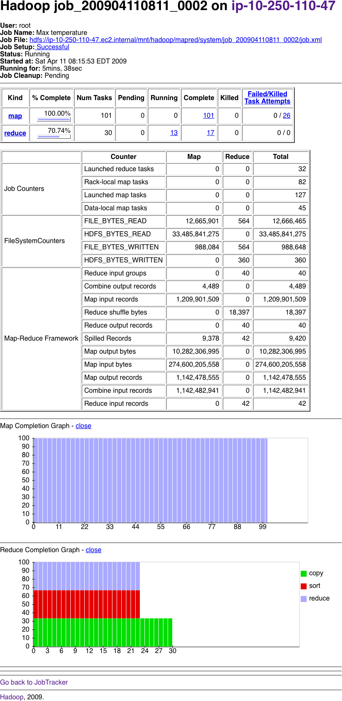

# Developing a MapReduce Application

## Configuration API

A Configuration class is used to access the configuration XML and can be combined (if a var is repeteated, last is used). Variables can also be expanded using system properties.

## Configuring the Development Environment

All JAR's from top level Hadoop directory must be added to the IDE. Also, you can have local and cluster file configurations.

## GenericOptionsParser, Tool and ToolRunner

* **GenericOptionsParser** interprets Hadoop command-line options and sets them on a Configuration object
* **Tool** is an interface to use the above class

The `-D` option takes priority over Configuration files

## Writing Unit Tests

### Mapper Unit Test

Because Mapper and Reducers writes to Context files (instead of returning the result) a mock for the Context object is needed. We use Mockito as follows:

	@Test
		public void processesValidRecord() throws IOException, InterruptedException {
			MaxTemperatureMapper mapper = new MaxTemperatureMapper();
			Text value = new Text(
				"0043011990999991950051518004+68750+023550FM-12+038299999V0203201N00261220001CN9999999N9-00111+99999999999"
				);
		
			MaxTemperatureMapper.Context context = mock(MaxTemperatureMapper.Context.class);
		
			mapper.map(null, value, context);
		
			verify(context).write(new Text("1950"), new IntWritable(-11));
		}
	}

We create the context object passing to the static `mock` method the class. Then we use it normally. Reducer unit test is similar.

## Running locally and in a cluster on Test Data

* **Locally** Using the Tool interface you could write a driver to configure the local job.

* **Cluster** No code changes are needed, just to pack the Jar.

## The MapReduce Web UI

### Jobtracker Page

1. Hadoop installation: version, compilation, jobtracker state...
2. Summary of the cluster: capacity, utilization, mr running, jobs, tasktrackers, slots, blacklisted Tasktrackers
3. Job Scheduler: Running and failed jobs with id's, owner, name...
4. Link to Jobtracker Logs: historic

### Job page

* Job progress
* Owner
* Name
* Running time
* Completion graphs

### Retrieving the results

Each map will write a single file. The `-getmerge` option of `hadoop fs` gets all files in a folder and merges the into a single local file.

### Debugging a Job: The tasks page

It is often useful to use a counter in the MR. Write a MR to read logs or write info to map output that can be check on the tasks page in the "status" column. The Action column allows to kill a task if `webinterface.private.actions` is set to true.

## Hadoop Logs

| Logs 						| Primary audience | Description |
| ------------------------- | ---------------- | ----------- |
System daemon logs 			| Administrators   | Each Hadoop daemon produces a logfile (using log4j) and another file that combines standard out and error. Written in the directory defined by the HADOOP_LOG_DIR environment variable |
HDFS audit logs 			| Administrators   |A log of all HDFS requests, turned off by default. Written to the namenode’s log, although this is configurable |
MapReduce job history logs  | Users 	       | A log of the events (such as task completion) that occur in the course of running a job.Saved centrally on the jobtracker, and in the job’s output directory in a _logs/history subdirectory |
MapReduce task logs 		| Users 		   | Each tasktracker child process produces a logfile using log4j (called syslog), a file for data sent to standard out (stdout), and a file for standard error (stderr). Written in the userlogs subdirectory of the directory defined by the HADOOP_LOG_DIR environment variable |

Logfiles can be found on the local fs of each TaskTracker and if JVM reuse is enabled, each log accumulates the entire JVM run.

Anything written to standard output or error is directed to the relevant logfile.

### Remote debugging

No direct ways. Options:

* **Reproduce the failure locally** Download the fail that makes the task to fail.
* **Use JVM debugging options** -XX:-HeapDumpOnOutOfMemoryError -XX:HeapDumpPath=/path/to/dumps to log Java out of memory errors.
* **Use task profiling** Mechanism to profile a subset of the task

Sometimes is useful to keep intermediate files for a failed task setting `keep.failed.task.files` to *true* that will store the files in the `mapred.local.dir` of the node.

## Tuning a Job to improve performance

| Area 						| Best Practice								|
| --------------------- 	+ ----------------------------------------- |
| Number of mappers			| How long are your mappers running for? If they are only running for a few seconds on average, then you should see if there’s a way to have fewer mappers and make them all run longer, a minute or so, as a rule of thumb. The extent to which this is possible depends on the input format you are using |
| Number of Reducers 		| For maximum performance, the  numberof reducers should be slightly less than the number of reduce slots in the cluster. This allows the reducers to finish in one wave and fully utilizes the cluster during the reduce phase |
| Combiners					| Can your job take advantage of a combiner to reduce the amount of data in passing through the shuffle? |
| Intermediate Compression  | Job execution time can almost always benefit from enabling map output compression |
| Custom serialization		| If you are using your own custom Writable objects, or custom comparators, then make sure you have implemented RawComparator |
| Shuffle Tweaks			| The MapReduce shuffle exposes around a dozen tuning parameters for memory management, which may help you eke out the last bit of performance |

### Profiling tasks

HPROF is enabled in JobConf:

	Configuration conf = getConf();
	conf.setBoolean("mapred.task.profile", true);	// Enable profiling
	conf.set("mapred.task.profile.params", "-agentlib:hprof=cpu=samples," +
		"heap=sites,depth=6,force=n,thread=y,verbose=n,file=%s");	//Params
	conf.set("mapred.task.profile.maps", "0-2"); // Tasks to profile
	conf.set("mapred.task.profile.reduces", ""); // no reduces
	Job job = new Job(conf, "Max temperature");

## MapReduce Workflows, job control

For a linear chain, use JobClient like `JobClient.runJob(conf1)`, `JobClient.runJob(conf2)`, etc. If a job fails will throw an IOException. You could also use JobControl from the client machine to represents a graph of jobs.

### Apache Oozie

1. **Workflow engine**: Stores and runs workflows composed of Hadoop jobs.
2. **Coordinator engine**: Run workflows jobs based on predefined schedules and data availability

**Oozie runs as a service in the cluster** receiving workflows (DAG) of **action nodes** (moving files in HDFS, running MR, Pig...) and **control flow nodes** (flow between action nodes).

* **Workflow**
	* One **start** and **one** end node.
	* `Kill` nodes finished a workflow as failed and reports the message specified
	* A **map-reduce** action
		* **job-tracker** Specifies jobtracker to submit
		* **name-node** URI for input/output data
		* A **configuration** element to specofy key/value pairs
	* A **prepare** action is executed before the map-reduce

#### Running an Oozie workflow job

	$ export OOZIE_URL="http://localhost:11000/oozie"
	$ oozie job -config [*.properties] -run

`-config` defines local Java properties in the workflow XML as well as `oozie.wf.application.path` which tells Oozie workflow app. `-info` gives info about the workflow job. A properties file:

	nameNode=hdfs://localhost:8020
	jobTracker=localhost:8021
	oozie.wf.application.path=${nameNode}/user/${user.name}/max-temp-workflow
