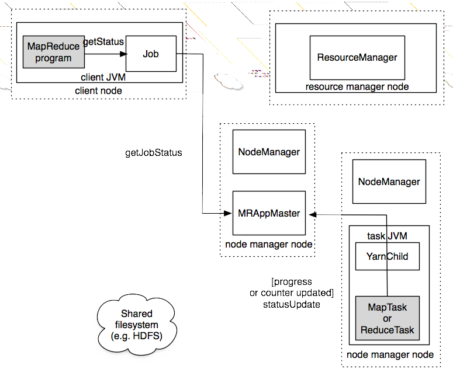

# How MapReduce Works

Prior to 0.23, setting `mapred.job.tracker` to **local**  the local job runner is used. YARN uses `mapreduce.framework.name` which takes the values **local**, **classic** and **yarn**

## Classic MapReduce (MapReduce 1)

1. Client submits job
2. **JobTracker** coordinates job run
3. **TaskTracker** run the tasks that the job has been split into
4. The **HDFS** is used for sharing job files.

**submit()** method on **Job** creates an internal **JobSummiter** and calls **submitJobInternal()** on it:

1. Asks jobtracker for new job ID calling **getNewJobId()** on **JobTracker**
2. Checks output dir
3. Computes input splits
4. Copies the needed resources (JAR, config file...). The JAR is copied with high replication factor set by `mapred.submit.replication` property (defaults to 10)
5. Tells the **JobTracker** the job is ready calling **submitJob()**

### Job Initialization

**JobTracker** enqueue the job and creates a list of tasks retrieving the input splits to create one map for each split. The number of reduce tasks to create is in `mapred.reduce.tasks` or set by the **setNumReduceTasks()**. Also a *job setup tasks* and a *job cleanup task* are run by the **TaskTrackers** to setup the job and cleanup after reduce tasks are completed. **OutputCommiter** the code to run

### Task Assignment

**TaskTrackers** tells JobTracker they are alive and if they are ready throught *heartbeat* calls and they have a fixed number of slots for map and reduce tasks. Map slots has priority over reduce ones.

The **JobTracker** picks a map task whose input split is as close as possible to the tasktracker If possible it will be *data-local*. Alternatively, *rack-local* (same rack). To choose a reduce it simply takes the next in the queue.

### Task Execution

The JAR is copied to the tasktracker's fs, creates a local working dir and a instance of TaskRunner

TaskRunner launches a new JVM (it can be re-used by tasks but shouldn't be shared with the TaskRunner). Each task can perform setup and cleanup actions determined by the OutputCommiter

### Progress and Status Updates

A job and its tasks have a status. The progress in the map is the proportion of the input that has been processed. For reducer is an estimation of the portion of the reduce. It can also be counters.

Clients can use **Job.getStatus()** to obtain a **JobStatus** instance

### Job completion

The jobtracker changes the status of the job to "successful", the **Job** polls for status and prints a message and returns from **waitForCompletion()**. It also sends a HTTP job notification if `job.end.notification.url` is set

## YARN (MapReduce 2)

Splits JobTracker into 2: a **resource manager** to manage the use of resources across the cluster and an **application master** to manage the lifecycle of the apps running the cluster. The idea is that an app negotiates with the *resource manager* for cluster resources. Each instance of an app has an **application master** that runs for the duration of the app.

MR on YARN has:

* The client which submits the MR job
* The YARN resource manager coordinates allocation of compute resources
* The YARN node managers: launch an monitor nodes
* The MR application master which coordinates tasks running the MR job. Application master and MR tasks run in containers that are scheduled by the resource manager and managed by the node manager.
* The distributed filesystem

### Job submission and initialization

Job is submitted calling **submitApplication()** and generates a job id, however it is now called application ID

The **application master (MRAppMaster)** initializes the job, retrieves input splits, create a map task for each split and the number of reduces set in `mapreduce.job.reduces`.

AppMaster then run the job in the same JVM if it's small (less than 10 mappers, only one reducer and input size is less than the size of one HDFS block) and it doesn't allocate too many containers and running tasks. This is called **uber task**.

| Uber Task property 				|
| --------------------------------- |
| mapreduce.job.ubertask.maxmaps 	|
| mapreduce.job.ubertask.maxreduces |
| mapreduce.job.ubertask.maxbytes 	|
| mapreduce.job.ubertask.enable 	|

### Task Assignment

AppMaster requests containers from **Resource manager** and memory, configurable throught `mapreduce.map.memory.mb` and `mapreduce.reduce.memory.mb`

The memory must be multiple of minimum allocation and it will request just the needed amount: 1024 mb `yarn.scheduler.capacity.minimum-allocation-mb` and the default maximum is 10240 `yarn.scheduler.capacity.maximum-allocation-mb`. So it'll request between 1gb and 10gb

### Task execution

**YarnChild** localizes resources and runs in a dedicated JVM (but it can't be reused)

### Progress and Status Updates

Reports every 3 seconds to AppMaster

### Job Completion

Every 5 seconds (configured in `mapreduce.client.completion.pollinterval`) client checks for completion usin **waitForCompletion()**

## Failures

### Classic MapReduce

#### Task Failure

JVM reports error to TaskTracker and exists. For Streaming a non-zero exit is a failure (configured in `stream.non.zero.is.failure`)

10 minutes (`mapred.task.timeout`) is the timeout for hanging. If it's passed the tastracker marks the task as failed. Timeout to zero disables timeout.

When **JobTracker** is notified of a task failure, it will reschedule the task in a different TaskTracker. If a task fails 4 times (`mapred.map.max.attempts` and `mapred.reduce.max.attempts`) **the whole job fails**. It can also be configured as a maximum allowed percentage (`mapred.max.map.failurs.percent` and `mapred.max.reduce.failures.percent`)

Tasks can also be killed throught command line and the Web UI

#### TaskTracker Failure

**JobTracker** notice a timeout failure (`mapred.task.tracker.expiry.interval`) on a tasktracker and removes it from the pool.

**Fault** occurs when `mapred.max.tracker.failures` pass 4 task failures on the same job. 4 faults (`mapred.max.tracker.blacklists`) **blacklists** the tasktracker. Faults expire one per day. Restarting a tasktracker makes it abandon the blacklist

#### JobTracker Failure

**Single point of failure** = The job fails. Jobs will need to be resubmitted

### Failures in YARN

#### Task Failure

Similar to classic.

#### Application Master failure

Marked as failed if they fail once (`yarn.resourcemanager.am.max-retries`). They can be recover if `yarn.app.mapreduce.am.job.recovery.enable` is set to true

#### Node Manager Failure

Stops sending heartbeat and is removed from resource manager (timeout set in `yarn.resourcemanager.nm.liveness-monitor.expiry-interval-ms).

Node managers are blacklisted if the numbers of failures for the application is high (`mapreduce.job.maxtaskfailures.per.tracker`)

#### Resource manager failure

Uses a checkpointing mechanism to save it's state (node managers and applications) and it is brought up (by an administrator).

The storage is configured via `yarn.resourcemanager.store.class`, by default it keeps in memory but ZooKeeper can be used

## Job Scheduling

Follows a FIFO approach, however with `mapred.job.priority` or **setJobPriority()** is used on **JobClient** to set he priority of a Job that the job scheduler knows which to choose next. However a low-priority long-running job will still block the rest (does not support *preemption*)

### Fair Scheduler

If a single job is running, it gets the whole cluster, as more jobs are submitted free tasks slots are given to five each user a fair share.

It supports preemption so if a task has not received its fair share for some time, the scheduler will kill tasks in pool to share some resources.

### Capacity Scheduler

Allows to separate a MapReduce Cluster with FIFO scheduling

## Shuffle and Sort

The input to every reducer is sorted by key, this is known as the *shuffle*

## The Map Side

Each map task has a circular memory buffer that it writes the output to. The buffer is 100 MB (`io.sort.mb`). When the content reaches a threshold (`io.sort.spill.percent`, default to 0.80) a background thread will spill the contents to disk. If the buffer is filled the map will block unil the spill is complete and a new spill file is created. Finally all the spills are merged and sorted again. `io.sort.factor` controls the maximum number of streams to merge at once (defaults 10)

Spills are written to the dirs in `mapred.local.dir` but before they are partitioned in as many reducers as they will be sent to. Within each partition a background thread performs an in-memory sort by key and if there is a combiner, it is run on the output.

If there are at least 3 spills files (`min.num.spills.for.combine`) the combiner runs again. It is possible also to compress the output (`mapred.compress.map.output` to **true**).

The output's are sent throught HTTP with a maximum of `tasktracker.http.threads` per tasktracker (not per map)

## The Reduce Side

Reduce tasks needs map output from several map tasks so reduce starts copying (with 5 threads as default `mapred.reduce.parallel.copies`) as soon as each map finish (*copy phase*).

Map outputs are copied to the reduce tasks JVM memory if they are small enough (`mapred.job.shuffle.input.buffer.percent`). When the in memory buffer reaches a threshold size (`mapred.job.shuffle.merge.percent`) or reaches a thresold number of map outputs (`mapred.inmem.merge.thresold`), it is merged and spilled to disk. Then they are merged into larger, sorted files.

When all map output have been copied, the reduce move to **sort** phase (properly called the *merge* phase) that merge map outputs maintaining their sort ordering. With 50 map outputs and a *merge factor* of 10 (`io.sort.factor`), each 10 files will output 1 intermediate file.

Lastly, the *reduce phase*, when it's feed of the previous outputs, the one that is written to HDFS.

## Configuration Tuning

General rule: give shuffle as much memory as possible. The amount given to JVM is `mapred.child.java.opts`. Avoid multiple spills on map. Try that the intermediate data on reduce reside entirely in memory, by default this does not happen because all memory is reserved for reduce but if reduce has light memory requirements, setting `mapred.inmem.merge.threshold` to **0** and `mapred.job.reduce.input.buffer.percent` to **1.0** may bring a performance boost.

You could also increase the hadoop's buffer size from 4kb to `io.file.buffer.size` property.

## Task Execution

MapReduce can obtain information of the environment (like file in process name) and read streaming environment variables.

## Speculative Execution

When a job is waiting for a task to finish the job, the cluster launches the same tasks on different nodes to get the result form the fastest one (and discard the rest).

### Speculative execution properties

| Property 										| Type 		| Defaul 	| Description 											|
| --------------------------------------------- | --------- | --------- | ----------------------------------------------------- |
| mapred.map.tasks.speculative.execution 		| boolean 	| true 		| Activated for map Tasks 								|
| mapred.reduce.tasks.speculative.execution 	| boolean 	| true 		| Activated for reduce tasks 							|
| yarn.app.mapreduce.am.job.speculator.class 	| Class 	| a class 	| Class implementing the speculative execution policy 	|
| yarn.app.mapreduce.am.job.task.estimator.class| Class 	| a class 	| Provides estimates for task runtimes 					|

The only reason to turn it off is to improve cluster efficiency, to avoid reduce tasks to fetch the same map outputs over the network and for tasks that are not idempotent.

## Output Committers

Used to ensure that jobs and tasks either succeed or fail throught the OutputCommiter class and methods. This are:

* **setOutputCommiter()** on JobConf
* **mapred.output.committer.class**
* **getOutputCommiter()**

### Task side-effect files

When writing custom outputs from reduce to HDFS, care needs to be taken that multiple instance don't try to write the same file.

### Task JVM Reuse

Jobs with many short-lived tasks can see performance gains with reusing but the task will run sequentially instead of concurrently

### Skipping bad records

*Skipping record* will re-try a task this way:

1. Task fail
2. Task fail
3. **Skipping record** enabled after to fails. Task fail but failed records are stored in the TaskTracker
4. With skipping mode enabled, task succeeds by skipping the records of the 3rd pass.

