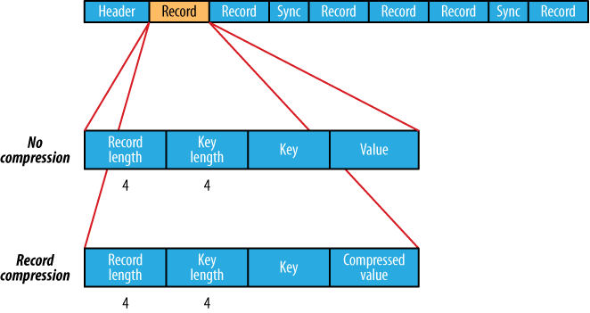
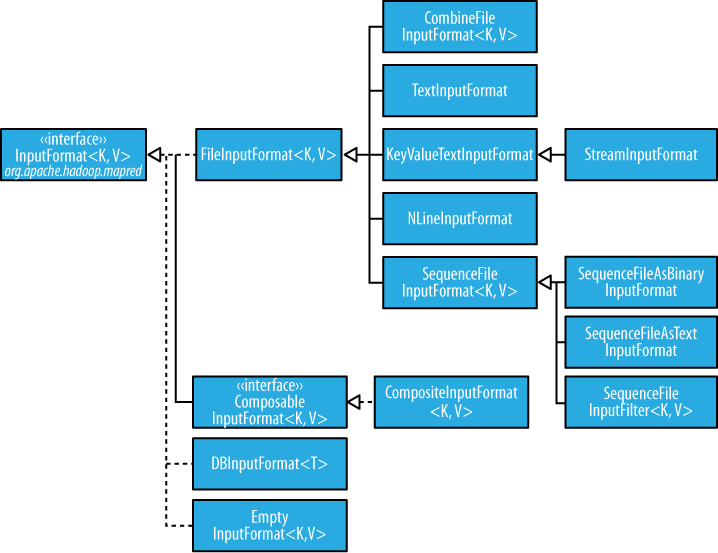
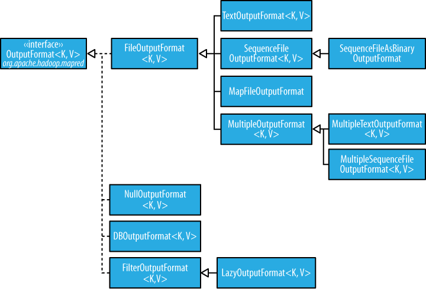

# MaReduce Types and Formats

## MapReduce types

* map: (k1, v1) -> list(k2, v2)
* combine: (k2, list(v2)) -> list(k2, v2)
* reduce: (k2, list(v2)) -> list(k3, v3)

Context objects are used for emitting key-value pairs. While it's good to match map output with reduce input, it's not enforced by the Java compiler

The partition operates on the intermediate key and value types (k2 and v2) and returns the partition index.

Input types are set by the input format, the other types are set in the Job. If not set, the intermediates types default to the final output types, so if k2 and k3 are the same there is no need to call **setMapOutputKeyClass()**. Some must be set because some in some aspects the type can be checked at compile time.

### The default MapReduce Job

When running a Job without setting a mapper nor reducer it will save on part-r-00* files an integer followed by a tab character and the original data. If we configure the same defaults it will be like the following Job:

```java
	@Override
	public int run(String[] args) throws Exception {
		Job job = JobBuilder.parseInputAndOutput(this, getConf(), args);
		
		job.setInputFormatClass(TextInputFormat.class);

		job.setMapperClass(Mapper.class);

		job.setMapOutputKeyClass(LongWritable.class);
		job.setMapOutputValueClass(Text.class);

		job.setPartitionerClass(HashPartitioner.class);

		job.setNumReduceTasks(1);

		job.setReducerClass(Reducer.class);

		job.setOutputKeyClass(LongWritable.class);
		job.setOutputValueClass(Text.class);

		job.setOutputFormatClass(TextOutputFormat.class);
		
		return job.waitForCompletion(true) ? 0 : 1;
	}
```

We set the input format as **TextInputFormat** which produces **LongWritable** (current line in file) and **Text** values. The integer in the final output is actually the line number. The map is the default **Mapper** that writes the same input key and value, by default **LongWritable** as input and **Text** as output.

The partitioner is **HashPartitioner** that hashes the key to determine which partition belongs in. There are as many partitions as reducers and we have only one in the default but if not all records will be evenly allocated across reduce tasks and they will share the same key.

The number of map tasks is equal to the number of splits that the input is turned into. The number of reducers will be equal to the number of nodes multiplied by the slots per node `mapred.tasktracker.reduce.tasks.maximum`. It it's good to have slightly fewer reducers than total slots.

The output key is **LongWritable** and the output value is **Text**. Records are sorted before the reducer.

### The default Streaming Job
```bash
	$ hadoop jar $HADOOP_INSTALL/contrib/streaming/hadoop*-streaming.jar \
	-input input/sample.txt \
	-output output \
	-mapper /bin/cat
```

There is not default identity mapper so it must explicitly be set. Hadoop Streaming output keys and values are always Text. Usually the key (the line offset) is not passed to the mapper. The default command set explicitly is:

```bash
	$ hadoop jar $HADOOP_INSTALL/contrib/hadoop-*streaming.jar \
	-input input/sample.txt \
	-output output \
	- inputformat org.apache.hadoop.mapred.TextInputFormat \
	-mapper /bin/cat \
	-partitioner org.apache.hadoop.mapred.lib.HashPartitioner \
	-numReduceTasks 1 \
	-reducer org.apache.hadoop.mapred.lib.IdentityReducer \
	-outputformat org.apache.hadoop.mapred.TextOutputFormat
```

#### Keys and Values in Streaming
A Streaming app can control the separator used when a key-value pair is turned into a series of bytes (defaults is tab char)




## Input formats
###InputSplits and Records
Each map processes a split that is divided into records. A client running a job calls **InputFormat.getSplits()** to retrieve the **InputSplit** list that is sent to the **JobTracker** to scheduling. On a **TaskTracker** the map passes the split to **InputFormat.createRecordReader()** to obtain the **RecordReader** (that is a iterator). The Map **run()** method:

```java
	public void run(Context context) throws IOException, InterruptedException {
		setup(context);
		while (context.nextKeyValue()) {
			map(context.getCurrentKey(), context.	getCurrentValue(), context);
		}
		cleanup(context);
	}
```

**run()** method is public and may be customized.

#### FileInputFormat
Base class of **InputFormat** for files. The input is a collection of input paths (file, directory or both)



To exlude certain files from the input, you can use **setInputPathFilter()**, by default it excludes hidden files.

##### FileInputFormat input splits
FileInputFormat splits files over the HDFS block size. You could also set a min and max size.

##### Small files and CombineFileInputFormat
**CombineFileInputFormat** packs many small files into each split. It also takes into account the node and rack locality.

You could also use a **SequenceFile**: keys are filenames and values file contents.

##### Preventing splitting
Some apps don't want files to be split, to avoid it you can increase the min split size to be larger than the largest file or subclass **FileInputFormat** to override the **isSplittable()** to return false.

##### File information in the mapper
A mapper processign a file input split can find information about the split by calling the **getInputSplit()** on Mapper's **Context** object

##### Processing a whole file as a record
First, avoid file splitting and to have a **RecordReader** that delivers the file contents as the value of the record.

### Text Input

#### TextInputFormat
Each record is a line of input. The key, a **LongWritable** is the byte offset (not line number) within the file of the beginning of the line.

##### KeyValueTextInputFormat
To interpret text files where the key needs to be something different than the line offset. For example, a file with key-values separated by commas:

	a,2
	a,3
	b,1

You can specify the separator (the comma) via the **mapreduce.input.keyvaluelinerecordreader.key.value.separator**

##### NLineInputFormat
To send a fixed number of lines to the mapper use NLineInputFormat

##### XML
**StreamXMLRecordReader** is used, setting the input format to **StreamInputFormat** and the **stream.recordreader.class** property to **org.apache.hadoop.streaming.StreamXmlRecordReader**

### Binary Input
#### SequenceFileInputFormat
The common way is to call **SequenceFileInputFormat** that will delivers the corresponding key-values, like IntWritable:Text but a casting is possible that it delivers only Text:Text with **SequenceFileAsTextInputFormat** or BytesWritable objects with **SequenceFileAsBinaryInputFormat**

### Multiple Inputs
All of the inputs is interpreted by a single **InputFormat** and a single **Mapper**. But when you have different inputs you must use the **MultipleInputs** class that allows to use the **InputFormat** and **Mapper** on a per-path basis.

### Database Input (and output)
**DbInputFormat** is for reading RDBS using JDBC. **DbOutputFormat** is for dumping the results to a DDBB.

**TableInputFormat** is used to read from **HBase**.

## Output Formats



### Text Output
The default **TextOutputFormat** writes records as lines of text tab-separated (that can be changed using `mapreduce.output.textoutputformat.separator`) calling to the **toString()** method on each record.

### Binary Output
#### SequenceFileOutputFormat, SequenceFileAsBinaryOutputFormat and MapFileOutputFormat
The two classes are to create **SequenceFile** files, with and without compression. **MapFileOutputFormat** is to write MapFiles.

### Multiple Outputs
For example, We will consult data from weather stations we would like to have a file for each station. To do this we need **MultipleOutputs** to write data to files whose names are derived from the output keys and values calling the **MultipleOutputs.write()** in the reducer instead of the Context.

### LazyOutput
**FileOutputFormat** will create output (part-r-nnnnn) files even if they are empty. **LazyOutput** is used to avoid this.