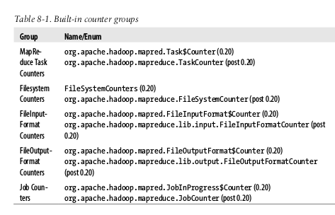
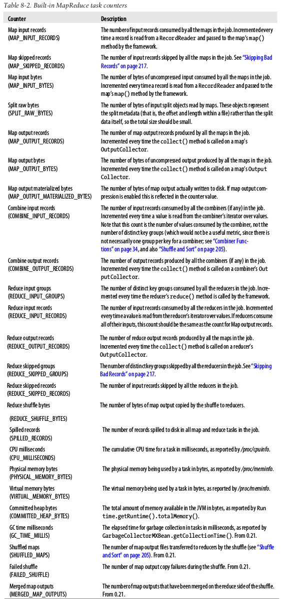
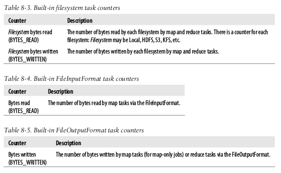
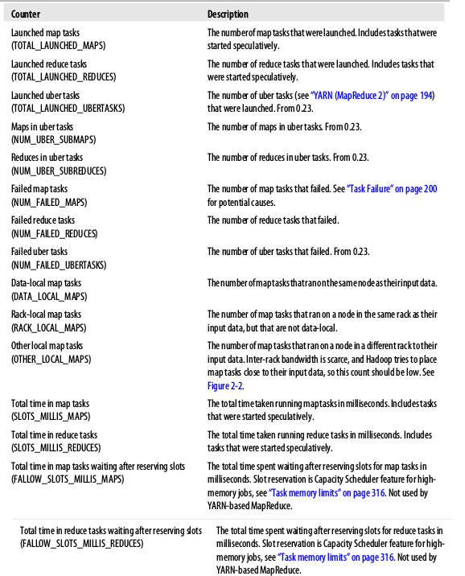
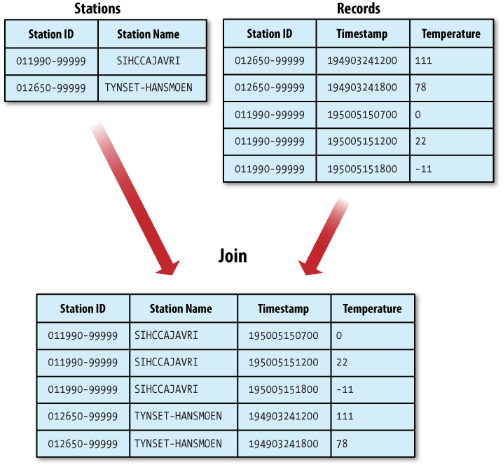
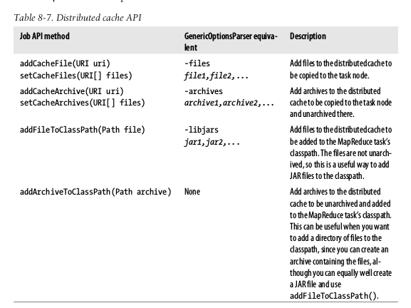
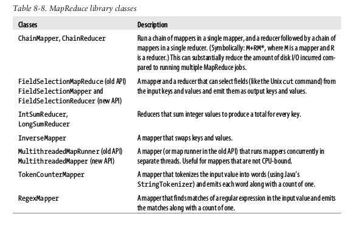

# MapReduce Features

## Counters
### Built-in Counters
Hadoop comes with some built-in counters to report various metrics for your job.



#### Task Counters
Gather information about tasks over their execution and are maintained by each task attempt. Periodically they are sent to the jobtracker or, if YARN is used, they are fully sent.





#### Job Counters



### User Defined Java Counters
Defined by a **Enum** and using a **Reporter.incrCounter()** object that can increment the counters.

#### Readable counter names
By default, a counter's name is the enum's fully qualified Java classname. To change it, you must create a properties file that must contain a single property named **CounterGroupName** with the value to display. The file must be named using an underscore as separator for nested classes and it must be placed in the same directory as the top-level class containing the *enum*.

#### Retrieving counters
Using **hadoop job -counter** you can retrieve counter values.

### User-Defined Streaming Counters
A Streaming program can also increment a counter by sending a formatted line to the standard error stream with the following format:

	reporter:counter:group,counter,amount

In Python:

```python
	sys.stderr.write("reporter:counter:Temperature,Missing,1\n")

## Sorting
To sort, we **must** sort a numeric key, but with **Text** it doesn't work

### Total sort: Producing a globally sorted file
Using a single partition is inneficient. The way is to produce a set of sorted files that concatenated would form a globally sorted file using a partitioner that respects the total order of the output. Althought you must be sure that the partitions size are fairly even:

| Temperature 			| -10 	| -10-0 | 0-10 | +10 |
| Proportion of records | 11% 	| 13% 	| 17%  | 59% |

This are not even. *Sampling* the key space to look at a small subset of the keys to approximate the key distribution. *Sampling* is to get a small subset of keys to approximate the key distribution. Hadoop already comes with a sampler called **InputSampler** The result could be something similar to:

| Temperature 			| -5.6 	| -5.6-13.9 | 13.9-22 | +22 |
| Proportion of records | 29% 	| 24% 	| 23%  | 24% |

### Secondary sort
For any particular reducer key, the values are *not* sorted. To sort the values we must change the keys to be a **composite of the key and the value**. 

For example the year and the temperature, that we want to sort by year and then by temperature. Next, the partition must be done by the year part of the key so we guaratee that the records for the same year go to the same reducer. Finally we must group values in the reducer by the year part, then we will see all the records for the same year in one reduce group. Summarizing:

* Make the key a composite of key and value
* The sort comparator should order by the composite key, that is, the key and value
* The partitioner and grouping comparator for the composite key should consider only the key for partitioning and grouping.

## Joins
###Map-Side Joins
Performs the join before the data reaches the map function. Each input dataset must be divided into the same number of partitions and it must be sorted by the same key. Also they must have the same number of reducers, the same keys and output files are not splittable.



Use a **CompositeInputFormat**to run a map-side join.

### Reduce-Side Joins
Is less efficient that the map-side. The mapper tags each record with its source and uses the join key as the map output key.

* *Multiple inputs*: **MultipleInputs** must be used as the input sources are usually different
* *Secondary sort*: To perform a join it's important to have the data ordered.

## Side Data Distribution
Considered extra read-only data needed by a job to process the main dataset.

### Using the Job Configuration
Arbitrary key/value pairs can be set in the job configuration using the setters for **Configuration** object. In the task you can retrieve it by **Context.getConfiguration()**

### Distributed Cache
#### Usage
For tools thatuse the **GenericOptionsParser* you can specify the files to be distributed as a comma-separated list of URIs as the argument to the **-files** options.

Files will be localized under the **${mapred.local.dir}/taskTracker/archive within each TaskTracker/Datanode node.

#### The distributed cache API
Putting data with **Job.addCacheXXXX()** and getting with **JobContext.setCacheXXXX()**.



## MapReduce Library Classes
Hadoop comes with a library of mappers and reducers for commonly used functions:

