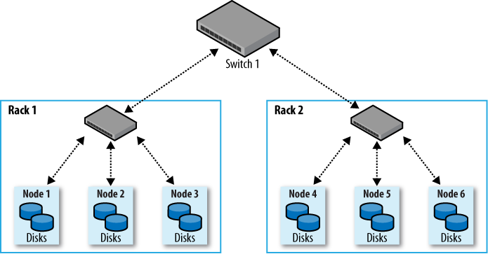
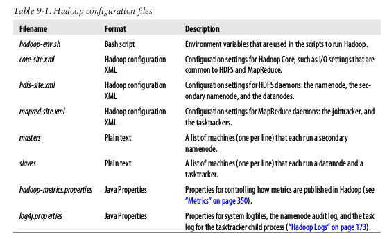
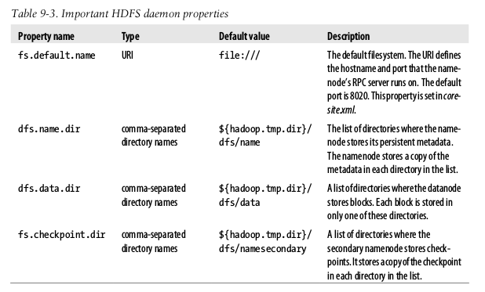
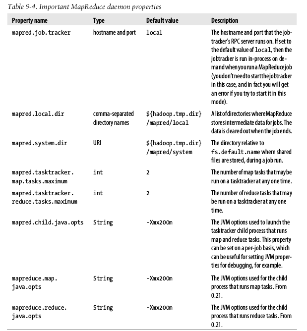
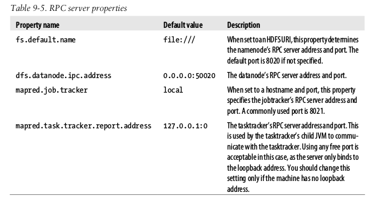
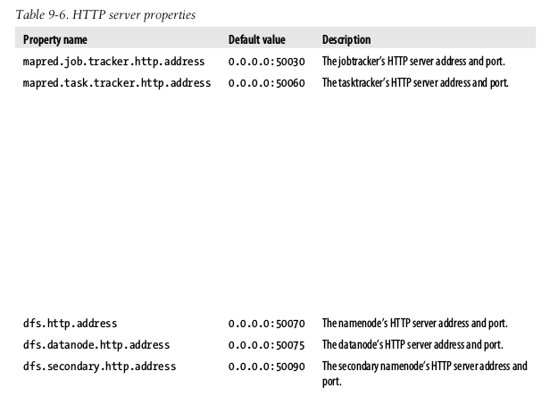
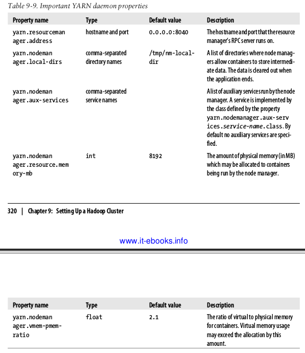
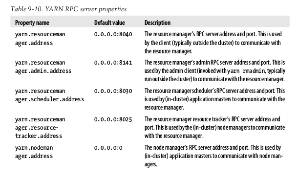
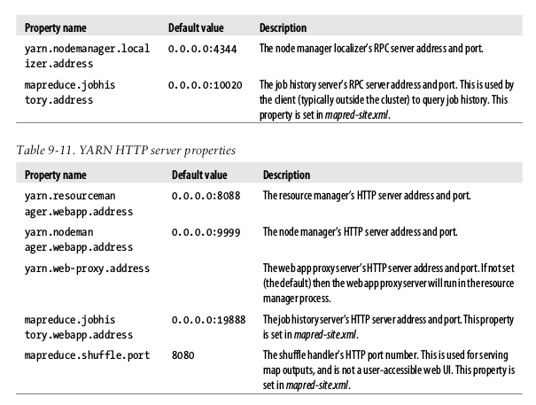
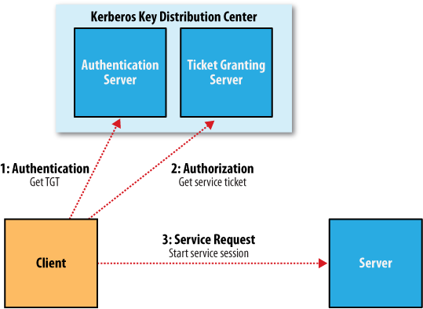

# Setting up a Hadoop Cluster

## Cluster specification
Hadoop uses "commodity hardware" that is easily available hardware (not low end). RAID is, however, not used for it's redundancy.

### Network Topology
Typically 30 servers per rack with 1 gb switch.



#### Rack awareness
If more than one rack is used, Hadoop must be configured to know the topology of the network (that is presented as a tree).

Hadoop conf must specify a map between node addresses and network locations described by the interface:

```java
	public interface DNSToSwitchMapping {
		public List<String> resolve(List<String> names);
	}
```

The **names** is a list of IP addresses and the return is a list of corresponding network location strings. However most installations don't need to implement the interface since the default implementation is **ScriptBasedMapping** which is located in **topology.script.file.name**.

## Cluster Setup and Installation
Java 6 or later is needed. A Hadoop use is also a good practice and ssh password-less access between machines.



### Configuration Management
Hadoop does not have a single file, global located, for conf info. Each node has its own set of conf files and the admins must sync them.

You'll need a *class* of machines because not all machines will have the same hardware nor the same configuration files.

#### Control scripts
Hadoop slaves conf file can be anywhere setting the **HADOOP_SLAVES** in the *hadoop-env.sh*. Also **these files doesn't need to be distributed to worker nodes**.

You don't need to specify which machine the namenode and jobtracker runs on in the *masters* file as this is determined by the machine the scripts are run on.

Scripts:

* **start-dfs.sh**:
	* Starts a namenode on the local machine.
	* Starts a datanode in each *slave* file.
	* Starts a secondarynamenode in the *masters* file.

* **start-mapred.sh**:
	* Starts a Jobtracker on the local machine
	* Starts a TaskTracker on each machine listed in the slaves file.

#### Master node scenarios
With more than 10 nodes it's convenient to put the Jobtracker, namenodes and secondarynamenodes on different machines. Namenode has high memory requirements, also the secondarynamenode (when not idle) because it keeps a copy of the latest checkpoint of the filesystem metadata. When the master daemons run on one or more nodes:

* Run HDFS control scripts from the namenode
* Run the MR control scripts from the JobTracker

### Environment Settings

#### Memory
Hadoop alllocates 1gb of memory to each daemon it runs (**HADOOP_HEAPSIZE** in *hadoop-env.sh*). In addition the tasktracker also launches separate child JVMs to run map and reduce tasks. The memory given to each JVM is `-Xmx200m` or 200mb

The max number of map/reduce tasks are set in `mapred.tasktracker.map/reduce.tasks.maximum` (default to 2). They are also related to number of processors available in a 2:1 ratio (two processes per processor). For example, with 8 processors if you want 2 processes on each, the maximum map/reduce tasks could be 7 (because datanode and tasktracker each take one slot). With higher (`-Xmx400m`) the total memory usage would be 7600mb that will run or not, depending of the rest of the processes (like if you use Streaming or not).

Master node, each of the namenode, secondary namenode and jobtracker needs 1gb each one.

#### System logfiles
Logfiles are store by default on **$HADOOP_INSTALL/logs** or in **HADOOP_LOG_DIR** within `hadoop-env.sh` file. The log4j is stored in a .log file and the combined standard output and error log and only the last five logs are retained.

Logfile names are a combination of the user, the daemon, the daemon name and the machine hostname.

#### SSH Settings
**ConnectTimeout** can be used to avoid that control scripts hang waiting a response. **StrictHostKeyChecking** can be set to **no** to automatically add new host keys to the known hosts files.

To pass extra options to SSH, define the **HADOOP_SSH_OPTS** in `hadoop-env.sh`.

Hadopo control scripts **can distribute config files to all nodes** of the cluster using *rsync* but isn't enabled by default. To enable, a **HADOOP_MASTER** must be defined in the `hadoop-env.sh` to point the directory to *rsync* to the nodes. The HADOOP_MASTER directory will be sync to the **HADOOP_INSTAL** dir.

### Important Hadoop Daemon Properties

#### HDFS



#### MapReduce



#### Hadoop Daemon Addresses and Ports





### Other Hadoop Properties

#### Cluster membership
A list of authorized machines are specified in the **dfs.hosts** for datanodes and **mapred.hosts** for tasktrackers as well as **dfs.hosts.exclude** and **mapred.hosts.exclude**.

#### Buffer size
Hadoop uses a 4kb buffer size for its I/O operations which is conservative and increasing to 128kb will give an improved performance in **io.file.buffer.size** in *core-site.xml*.

#### Reserved storage space
To reserve some space on the datanodes set **dfs.datanode.du.reserved** to the amount of bytes to reserve.

#### Trash
Minimum period a deleted file in HDFS is retain until ultimate deletion (**fs.trash.interval** defaults to 0 which is disable)

#### Reduce Slow Start
Reducers wait until 5% of the map tasks in a jab have completed before scheduling reduce tasks. For large jobs this will take slots while waiting. **mapred.reduce.slowstart.completed.maps** can be set to a higher value (like 0.8 = 80%)

#### Task memory limits
With *ulimit* or **mapred.child.ulimit** a limit for tasks is set

## YARN Configuration

* **yarn-env.sh**: Environment variables
* **yarn-site.xml**: Configuration settings for YARN daemons: resourcemanager, jobhistory, webapp and node managers.

### Important YARN Daemon Properties
*mapred-site.xml* is still used for general MapReduce properties.



#### Memory
YARN allows to request an arbitrary amount of memory (within limits) for a task instead of the fixed slot-way of Hadoop v1. **yarn.nodemanager.resource.memory-mb** can be set to a limit that can't be trespassed.

Also in map and reduce the physical memory limits can be set with **mapreduce.map/reduce.memory.mb**

### Yarn Daemon Addresses and Ports





## Security

### Kerberos and Hadoop

1. *Authentication*: Client authenticates itself to the Authentication Server and receives a timestamped Ticket-Granting Ticket (TGT)
2. *Authorization*: The client uses the TGT to request a service ticket from the Ticket Granting Server
3. *Service Request*: The client uses the service ticket to authenticate itself to the server that is providing the service the client is using (namenode or jobtracker).



Kerberos is enabled with **hadoop.security.authentication** in *core-site.xml* and **hadoop.security.authorization** to true to enable service level auth. You may configure Access Control Lists (ACLs) in the *hadoop-policy.xml* file.

### Delegation Token
Delegation tokes are used transparently by Hadoop, it is like a shared secret between the client and the server. They are generated by the server: it uses Kerberos on the first call and it will get a Delegation Token which the namenode can verify.

When it performs operations on HDFS, client uses a *block access token* that the namenode passes to the client in response to a metadata request. Client uses the block to access itself to datanodes. This closes the security hole where only the Job ID was needed to access to a block (by default enabled in **dfs.block.access.token.enable**)

When the job is finished, the delegation token are invalidated

### Other Security Enhancements

* Tasks can be run using the OS user rather thatn the tasktracker's user (**mapred.task.tracker.task-controller** to **org.apache.hadoop.mapred.LinuxTaskController**)
* When tasks are run as the user who submitted the job, the distributed cache is secure.
* Users can view and modify only their own jobs (**mapred.acls.enabled** to **true**)
* Shuffle is secure but not encrypted
* It's no longer possible for a malicious user to run a rogue node that can join the cluster. Daemons must authenticate against the namenode
* A datanode may be run on a privileged port (under 1024) so a client may be reasonably sure that it was started securetly.
* A task may only communicate with its parent tasktracker.

## Benchmarking a Hadoop Cluster

### Hadoop Benchmarks

#### Benchmarking HDFS with TestDFSIO
**TestDFSIO** tests I/O performance of HDFS by reading or writing files. For example, to write 10 files of 1000 mb each:

	$ hadoop jar $HADOOP_INSTALL/hadoop-*-test.jar TestDFSIO -write -nrFiles 10 -fileSize 1000

A read benchmark

	$ hadoop jar $HADOOP_INSTALL/hadoop-*-test.jar TestDFSIO -read -nrFiles 10 -fileSize 1000

#### Benchmarking MapReduce with Sort
Good for testing because it sends a full input dataset through the shuffle.

1. Generate some random data: `hadoop jar $HADOOP_INSTALL/hadoop-*-examples.jar randomwriter random-data`
2. Run the sort: `hadoop jar $HADOOP_INSTALL/hadoop-*-examples.jar sort random-data sorted-data`
3. Validate: `hadoop jar $HADOOP_INSTALL/hadoop-*-test.jar testmapredsort -sortInput random-data -sortOutput sorted-data`
 
#### Other benchmarks
* **MRBench**: runs a small job a number of times
* **NNBench**: load testing namenode hardware
* **Gridmix**: suite of benchmarks to model a realistic cluster overload

## Hadoop In The Cloud

### Hadoop on Amazon EC2
Use **Whirr** telling it the credentials and for launching. An example:

	bin/whirr launch-cluster --config recipes/hadoop-ec2.properties --private-key-file ~/.ssh/id_rsa_whirr

#### Configuration
Configuration is passed as bundles in a conf file with the **--config** option:

	whirr.cluster-name=hadoop
	whirr.instance-templates=1 hadoop-namenode+hadoop-jobtracker, 5 hadoop-datanode+hadoop-tasktracker
	whirr.provider=aws-ec2
	whirr.identity=${env:AWS_ACESS_KEY_ID}
	whirr.credential=${env:AWS_SECRET_ACESS_KEY}
	whirr.hardware-id=c1.xlarge
	whirr.image-id=us-east-1/ami-da0cf8b3
	whirr.location-id=us-east-1

All the options are self explanatory. The identity and credential uses environment variables set with `export` in bash. You can also override any of this properties passing them (without the whirr prefix) throught the command line.

#### Running a proxy
To set up the proxy:
	
	$ . ~/.whirr/hadoop/hadoop-proxy.sh

#### Running a MapReduce Job
You can run a MR job from within the cluster or from an external machine.

Whirr conf files are in ~/.whirr/hadoop and can be used to connect to the cluster by setting the **HADOOP_CONF_DIR** in *hadoop-env.sh* to it.

Then we need to populate the cluster with data from, for example, S3:

	$ hadoop distcp \
		-Dfs.s3n.awsAccessKeyId='...' \
		-Dfs.s3n.awsSecretAccessKey='...' \
		s3n://hadoopbook/ncdc/all input/ncdc/all

The the job is run as usual. To write the output to S3 the command is as follows:

	$ hadoop jar hadoop-examples.jar MyJob /input s3n://mybucket/output

#### Shutting Down a Cluster
	$ bin/whirr destroy-cluster --config recipes/hadoop-ec2.properties
