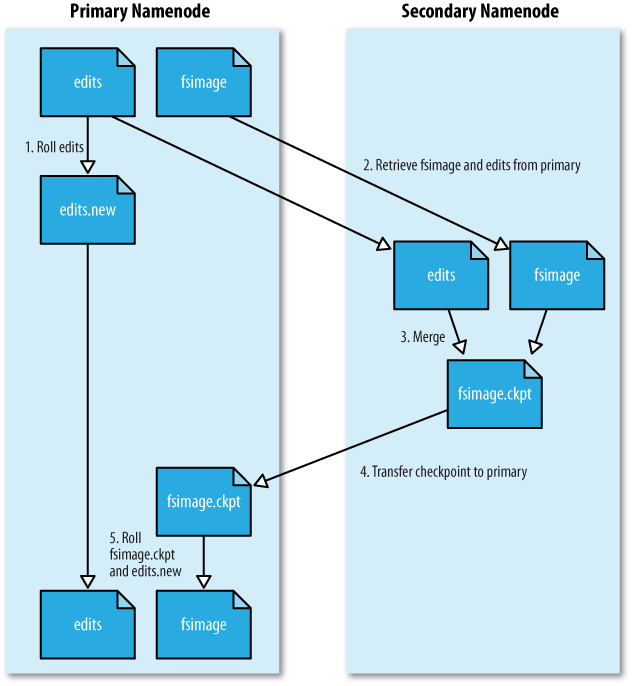

# Administering Hadoop
## HDFS
### Persistent Data Structures
#### Namenode Directory Structure

  {dfs.name.dir}/current/VERSION
 						/edits
						/fsimage
						/fstime

**VERSION** is a Java properties file that contains information about the version of HDFS:
	#Tue Mar 10 19:21:36 GMT 2009
	namespaceID=134368441
	cTime=0
	storageType=NAME_NODE
	layoutVersion=-18

**layoutVersion** defines the version of HDFS persistent data structures. Whenever the layout changes, the version is decremented

**namespaceID** Unique identifier for the filesystem to identify new datanodes.

**cTime**: marks the creation of the namenode's storage

**storageType**: Indicates that this storage directory contains data structures for a namenode.

#### The filesystem and edit log
When a filesystem client performs a write operation it is first recorded in the edit log. The *fsimage* file is a persisten checkpoint of the metadata.

#### Secondary namenode directory structure
Is identical to the namenode and it can be used to do manual backups.

#### Datanode directory structure
Has two types: HDFS blocks and the metadata for a block. When the blocks grows to 64 block new directory is created

### Safe Mode
When the namenode starts, the first thing it does is load its *fsimage* into memory and apply the edits from the *edits*.

Is needed to give datanodes time to check in to the namenode with their block lists so the namenode can be informed of enough block locations to run the filesystem.

#### Entering and leaving safe mode
To check:

	hadoop dfsadmin -safemode get

To wait for the namenode to exit safe mode:

	hadoop dfsadmin -safemode wait

To enter safemode:
	
	hadoop dfsadmin -safemode enter

To leave safemode:

	hadoop dfsadmin -safemode leave

### Audit Logging
HDFS can log filesystem access requests with *log4j*.

### Tools
#### dfsadmin
Is a tool for finding information about the state of HDFS.

#### Filesystem check (fsck)
For checking health of files in HDFS. It looks for:

* Over replicated blocks
* Under replicated blocks
* Misreplicated blocks (those that do not satisfy the block replica placement)
* Corrupt blocks
* Missing replicas

**Finding the blocks for a file**
	hadoop fsck /part -files -blocks -racks

#### Datanode block scanner
Blocks are periodically verified (`dfs.datanode.scan.period.hours`) to check for corrupt ones by scanning.

Also, the distribution of blocks can become unbalanced. The **balancer** is a daemon that re-distributes blocks.

## Monitoring
### Logging
All daemons produce logfiles, to **set the log levels** it can be change from their web pages

### Metrics
They belongs to a context: dfs, mapred, rpc and jvm. Are configured in the **conf/hadoop-metrics.properties** file, by default they do not publish:

	dfs.class=org.apache.hadoop.metrics.spi.NullContext
	mapred.class=org.apache.hadoop.metrics.spi.NullContext
	jvm.class=org.apache.hadoop.metrics.spi.NullContext
	rpc.class=org.apache.hadoop.metrics.spi.NullContext

* **FileContext**
Writes metrics to a local file exposing two properties: **filename** and **period**
* **GangliaContext**
Is a open-source distributed monitoring system. By using **GagliaContext** you can inject Hadoop metrics into Ganglia by, at least, defining one required property: **servers**.
* **NullContextWithUpdateThread**
Pulls metrics from Hadoop by periodically updating metrics stored in memory.
* **CompositeContext**
Output the same metrics to multiple context.

### Java Management Extensions
[!Hadoop MBeans](img/image-45.png)

Nagios and Hyperic can query MBeans for monitoring. All options for enabling remote access to JMX involve setting Java system properties editing *conf/hadoop-env.sh*

## Maintenance
### Routine Administration Procedures
#### Metadata backups
If the namenode’s persistent metadata is lost or damaged, the entire filesystem is rendered unusable so a backup can be done of the secondary's namenode *previous.checkpoint* property.

#### Data backups
The data to backup must be prioritized. Space quotas can be used to backup data at night.

### Commissioning and Decommissioning Nodes
#### New nodes
Configure the *hdfs-site.xml* to point to the namenode and the *mapred-site.xml* to the jobtracker and launch datanode and jobtracker. You must have a list of authorized nodes: `dfs.hosts` for the namenode and `mapred.hosts` for the jobtracker.

1. Add the network addresses of the new nodes to the include file
2. Update the namenode with the new set of permitted datanodes:
	hadoop dfsadmin -refreshNodes
3. Update the jobtracker with the new set of permitted tasktrackers:
	hadoop mradmin -refreshNodes
4. Update the slaves file
5. Start the new datanodes and tasktrackers
6. Check that the new nodes appears in the web UI

#### Decommissioning nodes
If you shut down a tasktracker running tasks, they will be re-scheduled: 

1. Add the network addresses of the nodes to the exclude file.
2. Update the namenode
	hadoop dfsadmin -refreshNodes
3. Update the jobtracker
	hadoop dfsadmin -refreshNodes
4. Go to the web UI and check whether the admin state has changed to "Decommission in progress"
5. When all datanodes report their state as "Decommissioned", then all the nodes have been replicated. Shut down the deccommissioned nodes.
6. Remove the nodes from the include file and run:
	hadoop dfsadmin -refreshNodes
	haddop mradmin -refreshNodes
7. Remove the nodes from the slaves file

### Upgrades
1. Make sure that any previous upgrade is finalized before proceeding with another upgrade.
2. Shut down MapReduce and kill any orphaned task processes on the tasktrackers.
3. Shut down HDFS and backup the namenode directories.
4. Install new versions of Hadoop HDFS and MapReduce on the cluster and on clients.
5. Start HDFS with the -upgrade option.
6. Wait until the upgrade is complete.
7. Perform some sanity checks on HDFS.
8. Start MapReduce.
9. Roll back or finalize the upgrade (optional).

* Start the upgrade
	$NEW_HADOOP_INSTALL/bin/start-dfs.sh -upgrade

* Wait until the upgrade is complete
	$NEW_HADOOP_INSTALL/bin/hadoop dfsadmin -upgradeProgress status