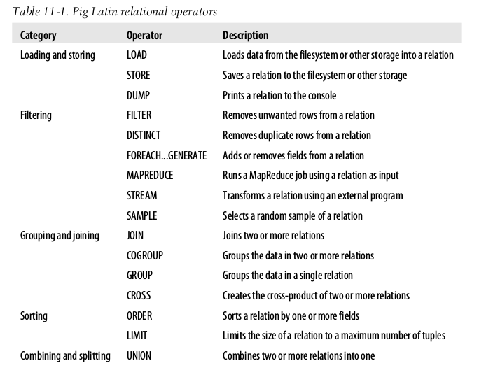

# Pig

* Pig latin (a language to express data flows)
* Execution environment: local or on hadoop cluster

Pig is for explore large datasets and is extensible. It cannot explore subsets.

## Hadoop mode

Pig translates queries into MapReduce jobs. The pig.properties must have:

	fs.default.name=hdfs://localhost/
	mapred.job.tracker=localhost:8021

## Running Pig Programs

* **Script**: A file with commands. PigPen is an Eclipse Plugin
* **Grunt**: Interactive shell
* **Embedded**: From Java using **PigServer** class

## Some example commands

* **LOAD (sample.txt) as (year:chararray, temperature int);** loads a file delimited by tabs
* **DUMP var;** Shows the contents of a var
* **DESCRIBE var;** Shows info about a var
* **FILTER records BY temperature != 9999** Filters a loaded file
* **GROUP filtered_records BY year;** Groups the contents using a column
* **FOREACH grouped_records GENERATE group;** Foreach process every row to to generate a derived set of rows with the fields of the GENERATE clause.
* **ILLUSTRATE var;** Shows pretty info of a var.

## Pig Latin

### Structure and statements

A Pig Latin script is a collection of statements. The interpreter checks that each statement is semantically and sintactically correct and adds it to the **logical plan** but does *not* execute the command yet until a **DUMP** or **STORE** statement is read.

With **REGISTER, DEFINE** and **IMPORT** you can register UDF and macros to Pig. There are also *commands* that are executed without being added to the logical plan like **set, rmf, exec** or **mkdir**. **set** is used to control Pig's behaviour througth options: `set debug on`.

### Expressions

| Category				| Expressions 		| Description 										| Examples 					|
| --------------------- | ----------------- | ------------------------------------------------- | ------------------------- |
| Field by position		| $n 				| Field in position *n* (zero based)				| $0 						|
| Field by name 		| f 				| Field named f 									| year 						|
| Field (disambiguation)| r::f 				| Field named f from relation r after grouping 		| A::year 					|
| Projection 			| c.$n, c.f 		| Field in container c, by position or name 		| record.$0, record.year 	|
| Map lookup 			| m#k 				| Value associated with key k in map m 				| items#'Coat' 				|
| Cast 					| (t) f 			| Cast of field f to type t 						| (int) year 				|
| Conditional 			| x ? y : z 		| y if x evaluates to true, z if not 				| quality == 0 ? 0 : 1 		|
| Flatten 				| FLATTEN(f)		| Removal of a level of nesting from bags and tuples| FLATTEN(group)			|

### Types

**TOTUPLE, TOBAG** and **TOMAP** are used to turn expressions into those types. A relation is a top-level construct whereas a bag has to be contained in a relation

### Schemas

Using the **AS** you can attach a schema to a **LOAD** statement.

	records = LOAD '/input' AS (temp:int, year:int)

Schema (type) declaration can be omitted too.

	records = LOAD '/input' AS (temp, year)

Anyways, schema is optional:

	records = LOAD '/input'

#### Validation and null

When trying to load a string into an int, it will fail and a null will be produce after a warning. **SPLIT** can also be used to split the data into *good* and *bad* data:

	SPLIT records INTO good_records IF temperature is not null;

### Functions
1. **Eval function**: A function takes one or more expressions and returns another expression.
2. **Filter function**: Returns a boolean result. Are used in FILTER operator.
3. **Load function**: Specifies how to load data into a relation from external storage.
4. **Store function**: A function that specifies how to save the contents of a relation to external storage.

### Macros
For example, we can extract the part of our Pig Latin program that performs grouping on a relation then finds the maximum value in each group, by defining a macro as follows:

	DEFINE max_by_group(X, group_key, max_field) RETURNS Y {
		A = GROUP $X by $group_key;
		$Y = FOREACH A GENERATE group, MAX($X.$max_field);
	};

## User defined functions (UDF)

### Filter UDF
Filter UDF's are all subclasses of **FilterFunc** which itself is a subclass of **EvalFunc** and implements the **exec(Tuple tuple)** methods. A **Tuple** is a list of type defined objects with **Tuple.get(int index)** to retrieve the objects within it. **exec** must return **True** or **False** if the row must be contained in the filter. The last step is to use **REGISTER** to use the function.

#### Leveragin types
When a "cell" has an invalid value (String casting to int for example), the UDF will fail. Error handling could be done within the function but it's better to tell Pig the types of the fields that the function expects with **getArgToFuncMapping()**

### Eval UDF
Must subclass **EvalFunc<T>** and implement **exec()** and return null or the *parsed* object.

#### Dynamic invokers
Allows to call Java object from Pig but they are done by reflection and with large datasets can impose overhead. For example, to use **StringUtils** class:

    grunt> DEFINE trim InvokeForString('org.apache.commons.lang.StringUtils trim', 'String');
    grunt> B = FOREACH a GENERATE trim(fruit);
    grunt> DUMP B;
    (pomegranate)
    (banana)
    (apple)

### Load UDF
Must extend **LoadFunc** and override:
* **setLocation(String location, Job job)**: Pass the input path location.
* **getInputFormat()**: Creates a RecordReader
* **prepareToRead(RecordReader reader, PigSplit split)**: Takes previous RecordReader.
* **getNext()**: Iterates throught the records

When using a schema, the fields need converting to the relevant type overriding **LoadCaster.getLoadCaster()** to provide a collection of conversion methods

## Data processing operators

### Storing data

    STORE a INTO 'out' USING PigStorage(":");

### Filtering Data

#### FOREACH...GENERATE
Acts on every row in a relation. It's similar to AWK, can be nested and can be used with UDF's.

#### STREAM
Transforms data using an external script:
    
    grunt> C = STREAM A THROUGHT 'cut -f 2';

You can provide a custom serializer implementing **PigToStream** and **StreamToPig**

### Grouping and joining data

#### JOIN

    C = JOIN A BY $0, B BY $1; --inner join

*Fragment replicate join* can be used when the relations can fit in memory:

    grunt> C = JOIN a BY $0, b BY $1 USING "replicated";

#### COGROUP
Returns a nested set of output tuples generating a tuple for each unique key.

    grunt> d = COGROUP a BY $0, b BY $1;
    grunt> DUMP d;
    ( 0, {}, {(Ali, 0)} )
    ( 1, {(1, Scarf)}, {} )
    ( 2, {(2, Tie)}, {(2, Joe), (2, Hank)} )

#### CROSS
Joins every tuple in a relation with every tuple in a second relation (watch out, the result will be even bigger than the source):

    grunt> DUMP x;
    (a)
    (b)
    grunt> DUMP y;
    (c)
    (d)
    grunt> z = CROSS x, y;
    grunt> DUMP z;
    (a, c)
    (a, d)
    (b, c)
    (b, d)

#### GROUP
Groups the data into a single relation

    grunt> DUMP a;
    (Joe, cherry)
    (Ali, apple)
    (Joe, banana)
    grunt> b = GROUP a BY SIZE($1);
    grunt> DUMP b;
    (5, {(Ali, apple)})
    (6, {(Joe, cherry), (Joe, banana)})

### Sorting data

    grunt> b = ORDER a BY $0, $1 DESC;

But any relation made after doesn't guarantee the order.

### Combining and splitting data
To combine several relations into one:

    grunt> DUMP a;
    (2,3)
    (1,2)
    
    grunt> DUMP b;
    (z,x,8)
    (w,y,1)

    grunt> c = UNION a, b;
    grunt> DUMP c;
    (2,3)
    (1,2)
    (z,x,8)
    (w,y,1)

Pig tries to merge the schemas from both relations if possible or leave it without schema if not.

## Pig in Practice

### Parallelism
Pig uses one reducer per 1gb of input up to a maximum of 999 reducers (`pig.exec.reducers.bytes.per.reducer` and `pig.exec.reducers.max`). **PARALLEL** and `set default_parallel` allows to set explicitly the number of reducers.
    
    grunt> g = GROUP a BY year PARALLEL 30;
    -- same as
    grunt> set default_parallel 30
    grunt> g = GROUP a BY year;

### Parameter substitution
You can send parameters into a script file that are read at runtime. For example a script that performs some analysis per day could receive the current day as param. For example **$input** and **$output** would specify input and output paths:

    --script
    r = LOAD '$input' AS (year, temp)
    -- dome some hack that creates z as result
    STORE z INTO '$output'

And this will be called using the following bash command:

    pig -param input=/user/input
        -param output=/user/output
        file.pig