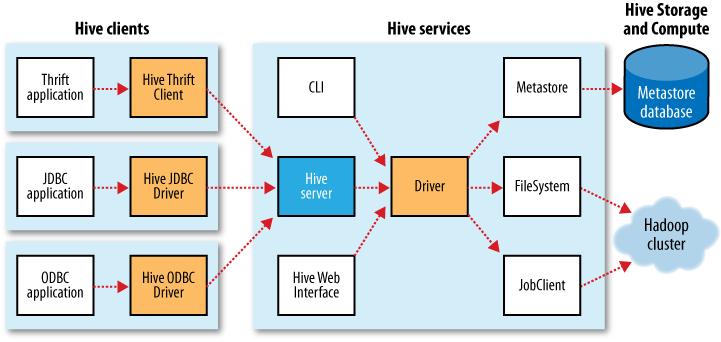
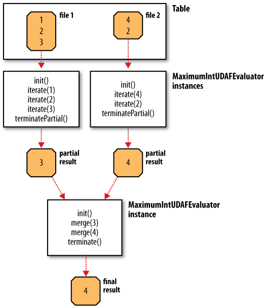

# Hive

## Running scripts

From the shell, simply run:

	$ hive -f script.q

	# Or

	$ hive -e 'SELECT * FROM dummy'

* http://reference.jumpingmonkey.org/database/mysql/cheatsheet.html
* http://hortonworks.com/blog/hive-cheat-sheet-for-sql-users/

## Commands

### Creating tables

	CREATE TABLE records (year STRING, temp INT, quality INT)
		ROW FORMAT DELIMITED
			FIELDS TERMINATED BY '\t';

Lines:

1. Create a table named "records" with 3 columns
2. Each row is tab delimited

### Populating tables

	LOAD DATA LOCAL INPATH 'input/sample.txt'
		OVERWRITE INTO TABLE records;

* Put the local file in the warehouse (no parsing)

`fs.default.name` is set to the default value of `file:///` so it will save to local. **Tables are stored as directories** under Hive's warehouse controller by `hive.metastore.warehouse.dir` property that defaults to */user/hive/warehouse*

**OVERWRITE** in the LOAD DATA tells Hive to delete any existing files.

## Running Hive

### Configuring Hive

In the `hive-site.xml` file you can set the typical `fs.default.name` and `mapred.job.tracker` to point the processes. It can also set per-session properties using `-hiveconf` to the hive command like this:

	hive -hiveconf fs.default.name=localhost

During a session it's possible to use `SET` to change any property. The priority list is the following:

1. SET
2. -hiveconf 
3. hive-site.xml
4. hive-default.xml
5. hadoop-site.xml
6. hadoop-default.xml

### Logging

Found in /tmp/$USER/hive.log. The log conf file is in `conf/hive-log4j.properties`

## Hive Services

Using `$ hive --service` option you can run the following:

1. cli: command line interface
2. hiserver: Hive server exposing a Thrift service for consumption (life JDBC)
3. hwi: Hive Web Interface
4. jar: Hive equivalent to `hadoop jar`
5. metastore: Used to run metastore as standalone

### Hice Clients

1. Thrift Client: Makes easy to run Hive commands from many programming languages.
2. JDBC Driver: `org.apache.hadoop.hive.jdbc.HiveDriver` using a form like `jdbc:hive://host:port/dbname`
3. ODBC Driver: Support for ODBC protocol

## The Metastore

A service and a backing store running on the same JVM (embedded metastore) that gives one session to Hive. With standalone database you can use multiple sessions (users)

The standalone metastore can be MySQL. The service must set to use the remote metastore with `hive.meta.store.local` to **false** and `hive.metastore.uris` to the metastore URI:

| Property name 						| Type					| Default value							  | Description															  |
| ------------------------------------- | --------------------- | --------------------------------------- | --------------------------------------------------------------------- |
| hive.metastore.warehouse.dir 			| URI 					| /user/hive/warehouse 				      | Directory relative to fs.default.name where managed tables are stored |
| hive.metastore.local 					| boolean 				| true 									  | Wether to use a embedded metastore or remote. If remote then next	  |
| hive.metastore.uris 					| comma-separated-URI's | Not set 								  | URI's specifying remote metastore 									  |
| javax.jdo.option.ConnectionURL 		| String 				| jdbc:derby:;db=metastore_db;create=true | JDBC URL of the metastore database 									  |
| javax.jdo.option.ConnectionDriverName | String 				| org.apache.derby.jdbc.EmbeddedDriver 	  | JDBC Driver classname 												  |
| javax.jdo.option.ConnectionUserName 	| String 				| APP 									  | JDBC User name 														  |
| javax.jdo.option.ConnectionPassword 	| String 				| mine 									  | JDBC Password 														  |

## Comparison with Traditional Databases

### Schema on Read Versus Schema on Write

In traditional the schema is enforced at data load time and if the data doesn't fit is rejected (*schema on write*). Hive verify in the query (*schema on read*).

## HiveQL

https://cwiki.apache.org/confluence/display/Hive/LanguageManual

(Hortonworks.CheatSheet.SQLtoHive.pdf)

### Data types

#### Primitives

| Type 		| Description 			| Examples									|
| --------- | --------------------- | ----------------------------------------- |
| TINYINT 	| 1-byte signed int 	| 1 										|
| SMALLINT 	| 2-byte signed int 	| 1 										|
| INT 		| 4-byte signed int 	| 1 										|
| BIGINT 	| 8-byte signed int 	| 1 										|
| FLOAT 	| 4-byte floating point | 1.0 										|
| DOUBLE	| 8-byte floating point | 1.0 										|
| BOOLEAN 	| true/false value 		| TRUE 										|
| STRING 	| Character String 		| 'a', "a" 									|
| BINARY 	| Byte Array 			| Not supported 							|
| TIMESTAMP | Timestamp with nanosec| 132500 , '2012-01-0203:04:05.123456789' 	|

#### Complex

| Type 		| Description 								| Examples				  									|
| --------- | ----------------------------------------- | --------------------------------------------------------- |
| ARRAY 	| Ordered collection of fields of same type	| array(1,2)												|
| MAP 		| Unordered collection of k/v pairs 		| map('a',1,'b',2) 											|
| STRUCT 	| Collection of named fields 				| struct('a', 1, 1.0). Created like STRUCT<a:STRING, b:INT> |

## Tables

A Hive table is logically made up of the data being stored and the associated metadata describing the layout of the data in the table.

Hive defaults moves the data into the warehouse unless is a *external table*
	
	CREATE TABLE managed_table (dummy STRING);
	LOAD DATA INPATH '/user/tom/data.txt' INTO table managed_table;

Will move hdfs://user/tom/data.txt into the warehouse. If the table is later dropped, using:

	DROP TABLE managed_table;

then the table, including its metadata **and its data is deleted**. Using *EXTERNAL* it doesn't move it nor check if it exists. If you drop it, it doesn't remove the data.

### Partitions

Hive organizes tables into partitions based on the value of a *partition column* (a way to organize columns based on common values like the year in a timestamp field). Subpartitions are also common.

Partitions at table creation time using **PARTITIONED BY**

	CREATE TABLE logs (ts BIGINT, line STRING)
	PARTITIONED BY (dt STRING, country STRING);

Then, when loaded:

	LOAD DATA LOCAL INPATH 'input/hive/partitions/file1'
	INTO TABLE logs
	PARTITION (dt='2001-01-01', country='GB');

At filesystem level it will create nested subdirectories. We can ask Hive for the partitions with the order `SHOW PARTITIONS;`

### Buckets

More efficient queries by joining to tables that are bucketed on the same columns and make sampling more efficient. If the data is sorted if even more efficient. The following command specifies columns and number of buckets.

	CREATE TABLE bucketed_users (id INT, name STRING)
	CLUSTERED BY (id) INTO 4 BUCKETS;

To populate, we need to set `hive.enforce.bucketing` to **true** and then using an insert with the current table. Each bucket will be a file in the table:

	INSERT OVERWRITE TABLE bucketed_users
	SELECT * FROM users;

## Storage formats

Hive table has two dimensions: *row format* (how rows and files are stored) and *file format* (container format fields in a row)

### Default storage format: delimited text

Default row delimiter is Ctrl-A. Default collection item delimiter is Ctrl+B

### Binary Storage formats: Sequence files and RCFiles

SequenceFile is default wen declare `STORED AS SEQUENCEFILE`. It supports **splittable compression**. Fields in each row are stored together.

RCFile (Record Columnar File) store in column oriented format. Permits columns that are not accessed in a query to be skipped

## Importing Data

### INSERT OVERWRITE TABLE

	INSERT OVERWRITE TABLE target
	SELECT col1, col2 FROM source

For partitioned tables you can specify the partition to insert into:

	INSERT OVERWRITE TABLE target
	PARTITION (dt='2010-01-01')
	SELECT col1, col2 FROM source;

### Multitable insert

	FROM source
	INSERT OVERWRITE TABLE target
		SELECT year, COUNT(DISTINCT station)
		GROUP BY year
	INSERT OVERWRITE TABLE records_by_year
		SELECT year, COUNT(1)
		GROUP BY year
	INSERT OVERWRITE TABLE good_records_by_year
		SELECT year, COUNT(1)
		WHERE temperature != 9999
		AND (quality = 0 OR quality = 1)
		GROUP BY year;

### Altering tables

Renaming (also moves the files:

	ALTER TABLE source RENAME TO target;

### Dropping tables

Deletes data and metadata:

	DROP TABLE target;

Deletes table contents: simply delete the files in the warehouse

## Querying Data

### Sorting and Aggregating

* Sorting: 
	* **ORDER BY** (setting reducers to one, inefficient with very large datasets)
	* **SORT BY**: Produces a sorted file per reducer

To control which reducer a particular row goes to, **DISTRIBUTE BY** can execute subsequent aggregation:

	hive> FROM records2
			SELECT year, temperature
			DISTRIBUTE BY year
			SORT BY year ASC, temperature DESC;
	
	1949 111
	1949 78
	1950 22
	1950 0
	1950 -11

## MapReduce Scripts

Using Hadoop Streaming, the **TRANSFORM**, **MAP** and **REDUCE** clauses make it possible to invoke an external script

hive> ADD FILE /path/to/is_good_quality.py;
		FROM records2
		SELECT TRANSFORM(year, temperature, quality)
		USING 'is_good_quality.py' 
		AS year, temperature;

## Joins

### Inner joins

Each match in the input tables results in a row in the output. Some DDBB allows to performs the JOIN in the WHERE clause. However is not possible in Hive at it must be write explicitly.

	SELECT sales.*, things.*
		FROM sales JOIN things ON (sales.id = things.id);

You can see how any MR jobs Hive will use for a query prefixing with the **EXPLAIN** clause (or **EXPLAIN EXTENDED**):

	EXPLAIN
	SELECT sales.*, things.*
	FROM sales JOIN things ON (sales.id = things.id);

### Outer joins

Allow to return also nonmatches of the *left* or *right* table. **LEFT OUTER JOIN**, **RIGHT OUTER JOIN**:

	SELECT sales.*, things.*
		FROM sales LEFT OUTER JOIN things ON (sales.id = things.id)

#### Semi joins

	SELECT *
	FROM things
	LEFT SEMI JOIN sales
	ON (sales.id = things.id);

#### Map joins

If one table is small enough to fit in memory, Hive can load it to perform the join in each of the mappers.

	SELECT /*+ MAPJOIN(things) */ sales.*, things.*
	FROM sales JOIN things ON (sales.id = things.id)

### Subqueries

Hive only permits a subquery in the FROM clause of a SELECT:

	SELECT *
	FROM (
		SELECT * 
		FROM records
		WHERE temp = 20) mt
	GROUP BY station, year;

## Views

	CREATE VIEW valid_records
	AS
	SELECT *
	FROM records2
	WHERE temp = 20

When creating a view, the Hive query is not run but stored in the metastore. Views are included in the **SHOW TABLES** and the **DESCRIBE EXTEND view** gives even the view query.

## User defined functions

Written in Java or using **SELECT TRANSFORM** if others used. Three types

* UDF's (regular): Operates in one row and produce one row too
* UDAFs (user-defined aggregate functions): Multiple input rows and a single row output
* UDTFs (user-defined table-generating functions): Operates in one row and produces multiple rows (a table)

### Writing an UDF

A class must extends org.apache.hadoop.hive.ql.exec.UDF and implement at least one **evaluate()** method. Then package as JAR, register it in Hive and create an alias:

	ADD JAR /path/to/hive-examples.jar
	CREATE TEMPORARY FUNCTION strip AS 'com.example.hive'

**TEMPORARY** means that the function is only defined during this session

### Writing an UDAF

The implementation has to be capable of combining partial aggregations into a final result. It must subclass **org.apache.hive.ql.exec.UDAF** and contain one or more nested static classes implementing **org.apache.hadoop.hive.ql.exec.UDAFEvaluator**. An evaluator must implements:

* **init()** resets internal state
* **iterate()** called every time a new value to be aggregated
* **terminatePartial()** called when Hive wants a result for the partial aggregation
* **merge()** called when Hive decides to combine aggregations
* **terminate()** called when the final result of the aggregation is needed

