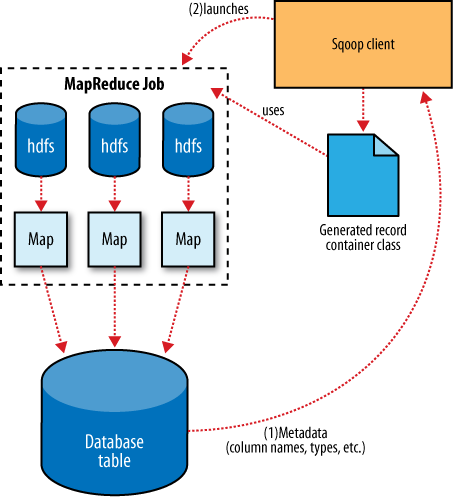

# Sqoop

## A sample import

Databases supported include:

* MySQL
* PostgreSQL
* Oracle
* SQL Server
* DB2

Example import:

	$ sqoop import --connect jdbc:mysql://localhost/db --table widgets -m 1

The `-m 1` will use only 1 map task to get a single file in HDFS. It will import in text format, however, it is possible to use a binary format.

## Generated code

When you do the import, it generates a *widget.java* written to the current local directory. This class is able of holding a record from DDBB, manipulate it in MR or store it in a SequenceFile in HDFS.

You can also generate the source code without importing importing the table with the command `sqoop codegen`.

Sqoop also supports Avro

## Database Imports: A Deeper Look

Sqoop examines the table, get all columns and types to map the to Java types and create a model of the table. Then, with the **readFields(ResultSet res)** and the **write(PreparedStatement s)** reads and writes the ddbb

## Hive tables throught Sqoop

	$ sqoop create-hive-table --connect jdbc:mysql://localhost/my_db --table widgets --fiels-terminated-by ','

	% hive> LOAD DATA INPATH "widgets" INTO TABLE widgets;

In short:

1. Import data into HDFS using Sqoop
2. Create a Hive table
3. Load the data into Hive

It can be done in a unique pass:

	$ sqoop import jdbc:mysql://localhost/my_db --table widgets -m 1 --hive_import

## Importing Large Objects (CLOB, BLOB)

Sqoop import large objects into a LobFile to access a field without accessing the record (it can be truly huge)

## Performing an export

The database must be prepared and the data types must be set explicitly when creating the MySQL table. The command:

	$ sqoop export --connect jdbc:mysql://localhost/my_db -m 1 --table sales --export-dir /user/hive/warehouse/zip --input-fields-terminated-by '\0001'

The `--input-fields-terminated '\0001'` is the default delimiter that is used in Hive

## Exports: A Deeper Look

The export process is similar: some parallel tasks performs queries to the MySQL ddbb but they are nor ordered or atomic operations. Sqoop can also exports records stored in SequenceFiles