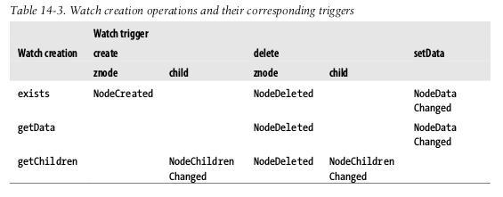
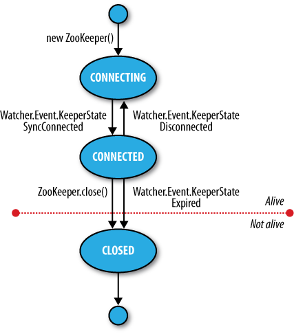

# ZooKeeper
## Features
* **Simple**: ZooKeeper at its core, a filesystem that exposes a few simple operations and some abstractions such as ordering and notifications.
* **Expressive**: ZooKeeper primitives are building blocks that can build a coordination data structure and protocol.
* **Highly available**:  Is run on a collection of machines to be highly available.
* **Facilitates loosely coupled interactions**: Interactors that doesn't need to know about each other
* **Is a library**: If common coordination patterns.

## Installing and running
We need to set up a conf file usually called *zoo.conf*:

	tickTime=2000
	dataDir=/Users/mac/zookeeper
	clientPort=2181

Ticktime is the time in miliseconds for heartbeats, dataDir is the persisten data directory for Zookeeper and the clientPort is the connection port for Zookeeper clients. With this, we can start the server:

	$ zkServer.sh start

Several commands are available to send to the server using **nc**:

## The ZooKeeper Service
### Data Model
Zookeeper maintains a hierarchical tree of nodes called znodes to store data. Zookeeper is designed for coordination of small size files.

Data access is atomic. The references are by paths like filesystems in Unix, so they aren't URI's.

#### Ephemeral and persistent znodes
An Ephemeral is deleted when the creating client's session ends. A persisten znode is not tied to any client.

#### Sequence numbers
A *sequential* znode has a number on its name and can be incremented. So if we create a node calle */a/b-* it may be called */a/b-1* and the next will be called */a/b-2*

#### Watches
Allows to clients to get notifications when a znode changes in some way

### Operations

| Operation 			| Description 												|
| --------------------- | --------------------------------------------------------- |
| create 				| Creates a znode (parent must already exist)				|
| delete 				| Deletes a znode 											|
| exists 				| Tests wether a znode exists and retrieves its metadata 	|
| getACL, setACL		| Get/sets the ACL for a node 								|
| getChildren 			| Gets a list of the children of a znode 					|
| getData, setData 		| Gets/sets the data associated with a znode 				|
| sync 					| Synchronizes a client's view of a znode with Zookeeper 	|

Update operations are conditional. **delete** or **setData** has to specify the version number of the znode that is being updated (found from **exists** call)

#### Multi-update
**multi** is used to batch multiple primitive operations

#### Watch triggers
**exists, getChildren** and **getData** may have watches (describe earlier) set on them.

#### ACLs
A znode is created with a list of ACLs, which determines who can perform certain operations on it. It depends on authentication:

1. *Digest*: Client is authenticated by a user and pass
2. *Sasl*: Client is authenticated using Kerberos
2. *Ip*: Client is authenticated by its IP address

## Implementation
With replication, it can provides service as long as the majority of the ensemble are up (3 of 5, 2 of 3).

Its work is simple, it ensure that the every modification to the tree znodes is replicated to a majority of the ensemble using a protocol called Zab that runs in two phases:

1. *Leader election*
2. *Atomic broadcast*: All write requests are forwarded to the leader which broadcasts the update to the followers.

### Consistency
Every update made to the znode tree is given a globally unique id called **zxid**.

* *Sequential consistency*: Updates from any particular client are applied in the order that they are sent.
* *Atomicity*: Updates either succeed or fail.
* *Single system image*: A client will see the same view of the system regardless of the server it connects to
* *Durability*: Once an update has succeeded, it will persist and will not be undone
* *Timeliness*: The lag in any client's view of the system is bounded so it will not be out of date by more than some multiple of tens of seconds.

### Sessions
A client tries to connect to the first Zookeeper of the list, if fails will go to the next until none is available.

Once connected a new session is created with a timeout period that a client must avoid by sending ping requests.

#### Time
A *thick time* is usually of 2 seconds that translates to an allowable session timeout between 4 and 40 seconds.

### States
Zookeeper object transitions throught different states in its lifecycle. You can query its state with **getState()**

**States** is an enum representing the different states.

A client using the **Zookeeper** object can receive notifications via a **Watcher** objects.

## Building Application with ZooKeeper
### A Configuration Service
Common pieces of configuration information can be shared by machines.

### The Resilient ZooKeeper Application
The programs so far have been assuming a reliable network so when they run on a real network, they can fail in several ways:

* **InterruptedException** thrown when an operation is interrupted but not neccesary is that it failed. Is a call to **interrupt()** method on the thread 
* **KeeperException**: Is thrown if the ZooKeeper server signals an error or if there is a communication problem with the server.
* **State exceptions**: When the operations fails because it cannot be applied to the znode tree.
* **Recoverable Exceptions**: The app can recover from this exception. Is thrown by **KeeperException.ConnectionLossException** which means that the connection to ZooKeeper has been lost.
* **Unrecoverable exceptions**: 

### A Lock Service
Distributed lock is a mechanism for providing mutual exclusion between a collection of processes.

## More Distributed Data Structures and Protocols
### BookKeeper and Hedwig
A highly available an reliable logging service. It can be used to provive write-ahead logging (the log is written before the operation).

BookKeeper clients create logs called ledgers and each record is called a *ledger entry* (a byte array). Hadoop namenode writes its edit log to multiple disks, one of which is tipically an NFS.

**Hedwig** is a topic-based publish-subscribe system build on BookKeeper

## ZooKeeper in Production
### Resilience and Performance
ZooKeeper machines should be located to minimize the impact of machine and network failure. This means that servers should be spread across racks, power supplies, and switches, so that the failure of any one of these does not cause the ensemble to lose a majority of its servers.

ZooKeeper has an observer nodes, which is like a non-voting follower. They allow a ZooKeeper cluster to improve read performance without hurting write performance. They allow a ZooKeeper cluster to span data centers without impacting latency as much as regular voting followers by placing the voting members in one data center and observers in the other.

### Configuration
Each server has a numeric identifier that is unique and must fall between 1 and 255. Is specified in plain text in a file named myid in the directory specified by the **dataDir** property.

We also need to give all the servers all the identities and network locations of the others in the ensemble. The ZooKeeper configuration file must include a line for each server, of the form:
	server.n=hostname:port:port

The value of n is replaced by the server number. The first port is the port that followers use to connect to the leader, and the second is used for leader election. Example:
	tickTime=2000
	dataDir=/disk1/zookeeper
	dataLogDir=/disk2/zookeeper
	clientPort=2181
	initLimit=5
	syncLimit=2
	server.1=zookeeper1:2888:3888
	server.2=zookeeper2:2888:3888
	server.3=zookeeper3:2888:3888

Servers listen on three ports: 2181 for client connections; 2888 for follower connections, if they are the leader; and 3888 for other server connections during the leader election phase